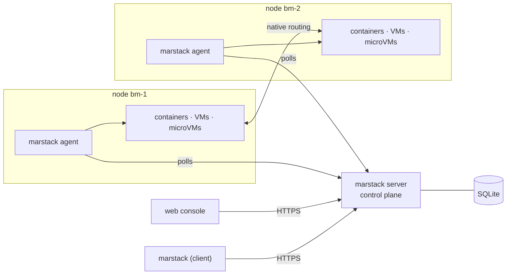

# marstack-cloud

[](https://github.com/MarStack-Labs/marstack-cloud/actions/workflows/ci.yml)
[](https://github.com/MarStack-Labs/marstack-cloud/releases)
[](go.mod)
[](LICENSE)

**[marstack-labs.github.io/marstack-cloud](https://marstack-labs.github.io/marstack-cloud/)**

**A cloud platform that runs containers, VMs, and microVMs as one kind of resource** — on a single
machine or across many baremetal ones, through the same code and the same API.

There is no "single node mode". A one-node cluster takes the same path a fifty-node one does, so
the thing you run on a laptop is the thing you run in a rack.

> **Status: pre-1.0.** Everything below works and is tested. The API, the CLI and the on-disk state
> may still change between minor versions. See the [changelog](CHANGELOG.md) for what has landed.

## Install

Take the archive for your platform from the [latest release][releases], check it, and put the binary
on your path:

```sh
shasum -a 256 -c SHA256SUMS
tar -xzf marstack_v0.2.0_linux_amd64.tar.gz
sudo install -m 0755 marstack_v0.2.0_linux_amd64/marstack /usr/local/bin/marstack
marstack version
```

One binary is three things: `marstack server` is the control plane, `marstack agent` runs on each
node, and every other command is the client.

[releases]: https://github.com/MarStack-Labs/marstack-cloud/releases

## Quickstart

```sh
marstack server --data-dir ~/marstack-data &
sudo marstack agent --name bm-1 --zone rack-a &

export MARSTACK_ENDPOINT=http://127.0.0.1:7443
export MARSTACK_TOKEN=$(cat ~/marstack-data/bootstrap-token)

marstack instance create --name api-1 --image alpine:3.20
marstack instance create --name db-1 --isolation vm --image ubuntu-24.04 --vcpu 4 --memory-mib 4096
marstack instance list
```

```
NAME    ID                ISOLATION   IMAGE          VCPU   MEMORY   DESIRED   OBSERVED   NODE
api-1   i-php2q13mwt3qy   container   alpine:3.20    1      512      running   running    bm-1
db-1    i-k7t4x9dm2wq8n   vm          ubuntu-24.04   4      4096     running   running    bm-1
```

The full walkthrough, including a second node and a real network, is in the
[handbook](docs/guide.md).

## What it does

| | |
|---|---|
| **Four isolations, one object** | `container`, `vm`, `microvm` and `sandbox` differ by a field, not by resource type — runc, QEMU, Cloud Hypervisor, Firecracker |
| **Networking without encapsulation** | native routing between nodes, a slice per node, full 1500 MTU, no switch configuration |
| **IPv4, IPv6 and dual stack** | a range per family, several interfaces per instance |
| **Storage that outlives the workload** | volumes, snapshots, rollback, scheduled snapshots, backups to S3 |
| **Services** | replicas, rolling updates, autoscaling on measured CPU or memory |
| **Load balancing** | TLS termination, routing by host and path, certificates from ACME with renewal |
| **Tenancy** | projects, roles, tokens with lifetimes, quotas, per-caller rate limits, an audit trail |
| **A node that survives the control plane** | the agent pulls, so a dead control plane never takes running instances with it |

## The web console

Optional, and not inside the binary. It is published as its own archive per release, so a control
plane that only answers the API never holds one.

```sh
marstack ui install
marstack server --ui-dir /var/lib/marstack/console
```

`marstack ui install` checks the archive against the release's `SHA256SUMS` and refuses anything
that does not match. Without `--ui-dir`, nothing is served at `/`.

## Documentation

| | |
|---|---|
| [Handbook](docs/guide.md) | what each part does, and what it was proved against |
| [CLI reference](docs/cli.md) | every command and flag, generated from the binary |
| [Architecture](docs/ARCHITECTURE.md) | the shape of the code and the boundaries the tests enforce |
| [Security](docs/SECURITY.md) | threat model and the invariants that hold |
| [Roadmap](docs/roadmap.md) | what is done and what is next |
| [Changelog](CHANGELOG.md) | what changed, per release |
| [Site](https://marstack-labs.github.io/marstack-cloud/) | the short version, on one page |

## How it fits together



Nodes are never dialled. The agent asks the control plane what should be running and makes it so,
which is why a node needs no inbound port and keeps its workloads when the control plane is gone.

## Design principles

| | |
|---|---|
| `N=1` is the general case | there is no "single node" mode — a one-node cluster takes the same code path |
| One `instance` object | containers, VMs, and microVMs differ by an `isolation` field, not by resource type |
| The agent reconciles | it does not take orders, so a dead control plane does not take running instances down |
| Native routing, no encapsulation | full 1500 MTU, zero switch configuration |
| Names, not addresses | every instance gets an internal DNS name the moment it is created |

## Development

Go 1.26 and a Linux host for anything that runs a workload. macOS runs the control plane and the
client; the [Lima VM](lima/README.md) covers the rest.

```sh
make hooks      # once per clone: install the pre-commit hook
make tools      # once: install staticcheck, govulncheck, gosec
make check      # vet, cross build, race tests, staticcheck, govulncheck, gosec
make docs       # regenerate docs/cli.md from the command tree
```

CI runs the same gates on every push and pull request, plus a cross build for `linux/amd64`,
`linux/arm64` and `darwin/arm64`. A `v*` tag builds those three, packs the console, and publishes a
release with checksums.

## Contributing

Issues and pull requests are welcome. `make check` has to pass, and a change to behaviour comes with
a test that fails without it. See [CONTRIBUTING.md](CONTRIBUTING.md).

## Security

Please do not open a public issue for a vulnerability. The threat model and how to report are in
[docs/SECURITY.md](docs/SECURITY.md).

## License

Apache-2.0 — see [LICENSE](LICENSE).
